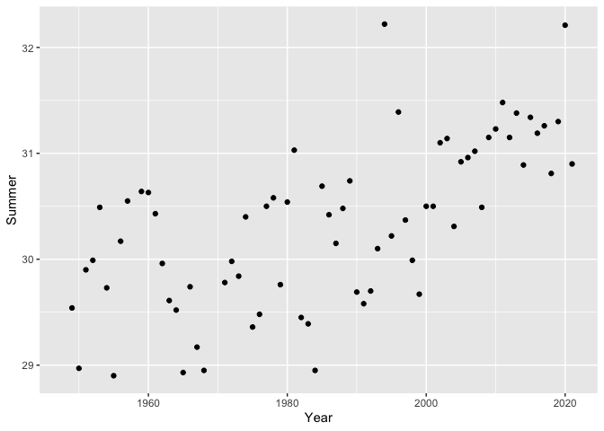
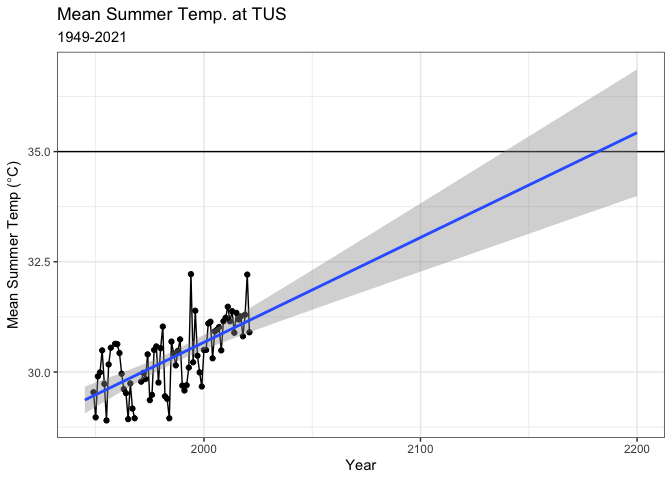
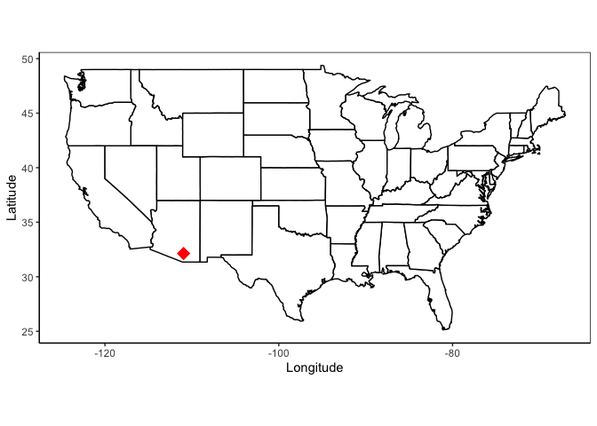
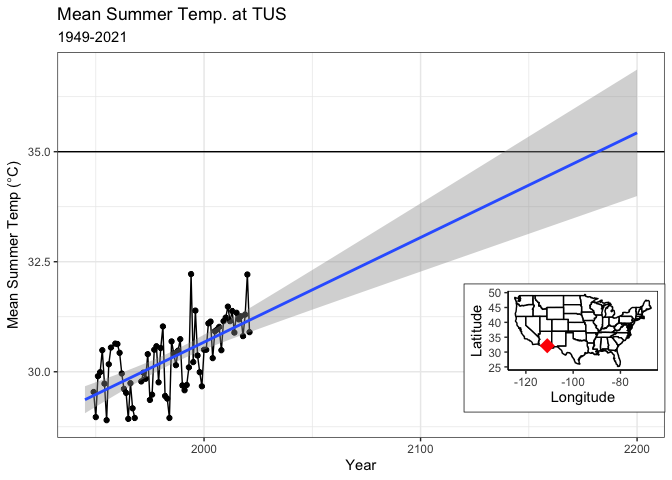

Mission Antarctica
================
Ellen Bledsoe
8/17/2021

Load the packages we will need:

``` r
library(tidyverse)
library(maps)
library(patchwork)
library(cowplot)
```

## Tucson Airport Temperature Data

-   Average monthly temperature (Celsius) data from the Tucson Airport
-   [Downloaded from
    NASA](https://data.giss.nasa.gov/cgi-bin/gistemp/stdata_show_v4.cgi?id=USW00023160&dt=1&ds=14)

``` r
tucson <- read_csv("../data/Tucson_Intl_Airport_WS.csv")
```

Let’s take a look at the data.

``` r
glimpse(tucson)
```

    ## Rows: 74
    ## Columns: 18
    ## $ YEAR    <dbl> 1948, 1949, 1950, 1951, 1952, 1953, 1954, 1955, 1956, 1957, 19…
    ## $ JAN     <dbl> 999.90, 6.70, 10.84, 10.78, 11.56, 12.77, 12.55, 8.80, 14.03, …
    ## $ FEB     <dbl> 999.90, 10.75, 14.57, 12.64, 11.47, 11.80, 16.34, 9.95, 9.87, …
    ## $ MAR     <dbl> 999.90, 14.85, 16.54, 14.71, 12.07, 16.49, 15.75, 15.94, 16.26…
    ## $ APR     <dbl> 999.90, 20.30, 21.27, 18.61, 18.98, 19.04, 22.54, 18.61, 18.47…
    ## $ MAY     <dbl> 999.90, 23.60, 22.59, 23.93, 25.48, 21.09, 25.02, 22.75, 24.93…
    ## $ JUN     <dbl> 999.90, 28.95, 28.19, 27.53, 29.15, 29.58, 28.98, 28.59, 30.73…
    ## $ JUL     <dbl> 999.90, 30.08, 28.83, 32.19, 30.58, 31.06, 31.04, 29.80, 30.28…
    ## $ AUG     <dbl> 999.90, 29.59, 29.90, 29.97, 30.24, 30.84, 29.16, 28.31, 29.49…
    ## $ SEP     <dbl> 999.90, 28.52, 26.33, 29.04, 29.11, 28.90, 28.90, 27.93, 29.67…
    ## $ OCT     <dbl> 999.90, 19.73, 25.50, 23.11, 25.25, 22.26, 24.05, 24.11, 21.83…
    ## $ NOV     <dbl> 12.58, 18.57, 17.83, 15.35, 14.13, 17.06, 17.68, 15.32, 14.94,…
    ## $ DEC     <dbl> 11.27, 11.21, 14.47, 11.43, 10.65, 9.83, 12.46, 13.67, 12.01, …
    ## $ `D-J-F` <dbl> 999.90, 9.57, 12.21, 12.63, 11.49, 11.74, 12.91, 10.40, 12.52,…
    ## $ `M-A-M` <dbl> 999.90, 19.58, 20.13, 19.08, 18.84, 18.87, 21.10, 19.10, 19.89…
    ## $ `J-J-A` <dbl> 999.90, 29.54, 28.97, 29.90, 29.99, 30.49, 29.73, 28.90, 30.17…
    ## $ `S-O-N` <dbl> 999.90, 22.27, 23.22, 22.50, 22.83, 22.74, 23.54, 22.45, 22.15…
    ## $ metANN  <dbl> 999.90, 20.24, 21.13, 21.03, 20.79, 20.96, 21.82, 20.21, 21.18…

Note the 999.9s in the data. This is a common way of indicating that
there is no data, or NA. Let’s tell R to convert 999.9 to NAs.

``` r
tucson <- read_csv("../data/Tucson_Intl_Airport_WS.csv",
                   na = "999.9") %>% 
  rename(Summer = `J-J-A`, Year = YEAR)
glimpse(tucson)
```

    ## Rows: 74
    ## Columns: 18
    ## $ Year    <dbl> 1948, 1949, 1950, 1951, 1952, 1953, 1954, 1955, 1956, 1957, 19…
    ## $ JAN     <dbl> NA, 6.70, 10.84, 10.78, 11.56, 12.77, 12.55, 8.80, 14.03, 12.7…
    ## $ FEB     <dbl> NA, 10.75, 14.57, 12.64, 11.47, 11.80, 16.34, 9.95, 9.87, 16.8…
    ## $ MAR     <dbl> NA, 14.85, 16.54, 14.71, 12.07, 16.49, 15.75, 15.94, 16.26, 15…
    ## $ APR     <dbl> NA, 20.30, 21.27, 18.61, 18.98, 19.04, 22.54, 18.61, 18.47, 19…
    ## $ MAY     <dbl> NA, 23.60, 22.59, 23.93, 25.48, 21.09, 25.02, 22.75, 24.93, 22…
    ## $ JUN     <dbl> NA, 28.95, 28.19, 27.53, 29.15, 29.58, 28.98, 28.59, 30.73, 30…
    ## $ JUL     <dbl> NA, 30.08, 28.83, 32.19, 30.58, 31.06, 31.04, 29.80, 30.28, 31…
    ## $ AUG     <dbl> NA, 29.59, 29.90, 29.97, 30.24, 30.84, 29.16, 28.31, 29.49, 29…
    ## $ SEP     <dbl> NA, 28.52, 26.33, 29.04, 29.11, 28.90, 28.90, 27.93, 29.67, 27…
    ## $ OCT     <dbl> NA, 19.73, 25.50, 23.11, 25.25, 22.26, 24.05, 24.11, 21.83, 20…
    ## $ NOV     <dbl> 12.58, 18.57, 17.83, 15.35, 14.13, 17.06, 17.68, 15.32, 14.94,…
    ## $ DEC     <dbl> 11.27, 11.21, 14.47, 11.43, 10.65, 9.83, 12.46, 13.67, 12.01, …
    ## $ `D-J-F` <dbl> NA, 9.57, 12.21, 12.63, 11.49, 11.74, 12.91, 10.40, 12.52, 13.…
    ## $ `M-A-M` <dbl> NA, 19.58, 20.13, 19.08, 18.84, 18.87, 21.10, 19.10, 19.89, 19…
    ## $ Summer  <dbl> NA, 29.54, 28.97, 29.90, 29.99, 30.49, 29.73, 28.90, 30.17, 30…
    ## $ `S-O-N` <dbl> NA, 22.27, 23.22, 22.50, 22.83, 22.74, 23.54, 22.45, 22.15, 20…
    ## $ metANN  <dbl> NA, 20.24, 21.13, 21.03, 20.79, 20.96, 21.82, 20.21, 21.18, 21…

That’s better!

Now, let’s plot the summer data. This is when the temps are hottest. It
is also monsoon season, so the humidity is higher. This *could* lead to
“wet-bulb” temperatures of 35 C, which are extremely dangerous to
humans.

``` r
ggplot(data = tucson, aes(x = Year, y = Summer)) +
  geom_point() 
```

<!-- -->

It’s a good start, but let’s make it better.

``` r
ggplot(data = tucson, aes(x = Year, y = Summer)) +
  geom_point() +
  geom_line() +
  stat_smooth(method = 'lm') +
  labs(
    title = "Mean Summer Temp. at TUS",
    subtitle = "1949-2021",
    x = "Year",
    y = expression("Mean Summer Temp ("*degree*"C)")
  ) +
  theme_bw()
```

<!-- -->

There’s a clear upward trend in temperatures, which makes sense.

Now let’s extrapolate. When does the average summer temperature become
35 C?

-   NOTE: I’m not suggesting that this is the best method for
    prediction! This is simply an example of something you *can* do.

``` r
temp <- ggplot(data = tucson, aes(x = Year, y = Summer)) +
  geom_point() +
  geom_line() +
  geom_hline(yintercept = 35) + # 35 wet-bulb is too much
  xlim(1945, 2200) +
  stat_smooth(method = 'lm', fullrange = TRUE) +
  labs(
    title = "Mean Summer Temp. at TUS",
    subtitle = "1949-2021",
    x = "Year",
    y = expression("Mean Summer Temp ("*degree*"C)")
  ) +
  theme_bw()
temp
```

<!-- -->

Looks to be around the year 2180.

Let’s make a map with Tucson highlighted so people know what location we
are talking about.

``` r
# get data for map of US
us_states <- map_data("state") %>% 
  rename(Latitude = lat, Longitude = long)

# make a dataframe that has TUS location
tucson_airport <- data.frame(
  Latitude = c(32.1314),
  Longitude = c(-110.9553)
)

# plot map with TUS
map <- ggplot(us_states) +
  geom_polygon(aes(x = Longitude, y = Latitude, group = group), 
               fill = "white", color = "black") +
  coord_quickmap() + 
  geom_point(tucson_airport, mapping = aes(x = Longitude, y = Latitude), 
             color = "red", size = 5, shape = 18) +
  theme_classic() +
  theme(panel.border = element_rect(color = "black", fill = NA))
map
```

<!-- -->

We can plot these next to each other

``` r
plot <- map + temp
plot
```

<!-- -->

Maybe better way to incorporate the map is as an insert?

``` r
# the ggdraw() and draw_plot() functions are from the `cowplot` package
ggdraw() +
  draw_plot(temp) +
  draw_plot(map, height = 0.3, width = 0.3, x = 0.68, y = 0.125)
```

<!-- -->

Other extrapolation analysis options: ARIMA

``` r
library(forecast)

# time-series analysis
summer_ts <- ts(tucson$Summer)  # make temp data into a time series
model <- auto.arima(summer_ts)  # find the best ARIMA for the data
plot(forecast(model, h = 20))   # we can use the ARIMA to forecast 20 years out
```

<!-- -->

``` r
plot(forecast(model, h = 200))  # also 200 years out
abline(h = 35)                  # add a line that indicates our cut-off
```

<!-- -->
